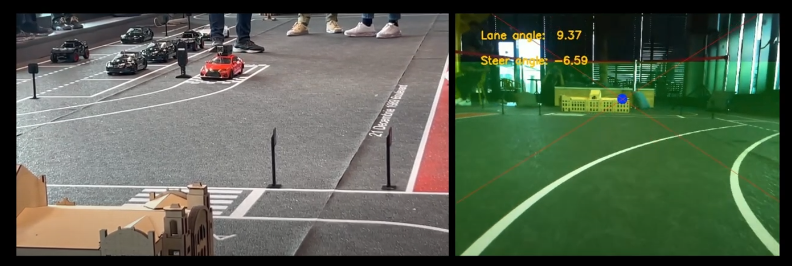

In 6 months, we developed hardware and software for a 1/10-scale car as part of the Bosch Future Mobility Challenge 2024, for which we qualified as a Top 24 Semi-Finalist from teams worldwide and competed in-person in Cluj-Napoca, Romania. **Highlights from our demo run are online in the demo link above!**

### Features

- Lane detection using Hough lines, whose output is sent as an input into a proportional controller for lane steering
- Custom 3D-printed hardware for the camera holder, and we migrated from an SPI-band connection to a USB-connection for additional reliability
- We evaluated using a Kalman filter for increased localization accuracy, though ended up relying solely on lane markings and (at least in an ideal, fully-functioning world) coordinates given by the local network
- Developed a finite state machine approach in the end, though we were limited on time for testing its components

### Limitations/Future Work

- Due to time constraints, our finite state machine appraoch was developed shortly before the demo run and had untested components. Future work should easily test separate components individually and together.
- Similarly, our finite state machine had a pre-planned trajectory. The ideal case would have been to have a localization model output the location coordinates at any given starting point, and dynamically generate a path to the endpoint.
