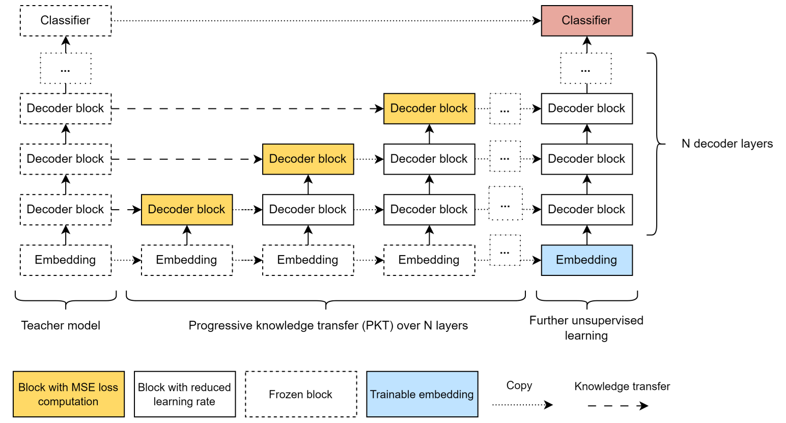

We evaluated the effectiveness of distillation to transfer knowledge from an attention-based transformer to a Hyena-based transformer, a state-space language model. Our paper was accepted as an ICML 2024 workshop paper at ES-FoMo-II, and is accessible at [arxiv.org/abs/2401.17574](https://arxiv.org/abs/2401.17574).
