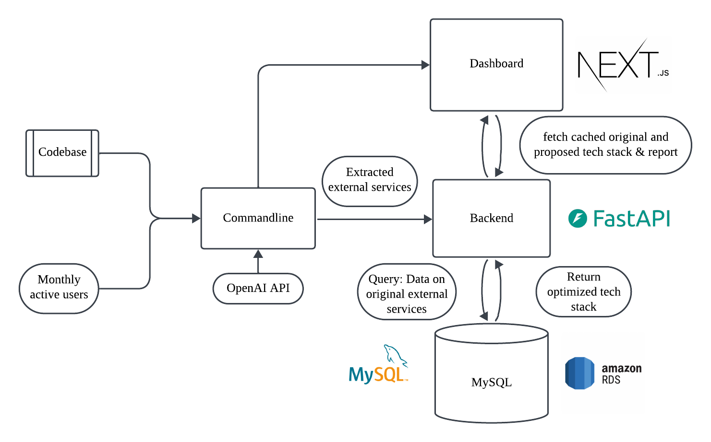

In a team of 4, we developed a command-line tool that scans GitHub repositories for external dependencies (i.e. AWS), provides a cost estimate that we visualize in a dashboard, and then use Defang to generate a minimal, proof-of-concept product based on a language-model generated summary of the original project.

We developed this project in 36 hours at the University of Pennsylvania during the PennApps XXV hackathon, for which we won the Best Use of Defang Prize.

### Features

- We use the GitHub API to scan GitHub repositories, which is accessible to the user via our underflow CLI
- Underflow leverage large language models to identify the external services that are present in the scanned codebase
- The CLI then look up the associated costs to each service on our MySQL database
- Next, underflow visualizes the results on a client-facing dashboard
- Finally, we use Cerebras to provide a summary of the code, and then use Defang to generate a proof of concept alternative with the goal of minimizing runtime costs

### Limitations/Future Work

- As this was done during a 36-hour hackathon, we compromised on some features in order to show a proof-of-concept demo:
  - Costs may not necessarily be accurate, and we would need additional mechanisms to verify their accuracy
  - While language models are able to detect external dependencies given lines of code, for the demo we would display additional dependencies to showcase underflow's ability to analyze multiple dependencies at once - a production-version should scale back and only display the existing external dependencies
  - The Defang generated code was often a simplified web app that did not contain the external services of interest. Future work should ensure that the desired functionality (i.s. an AWS S3 bucket for storage) persists in the generated codebase, whether it's the initial external service or an equivalent one (i.e. Supabase).
